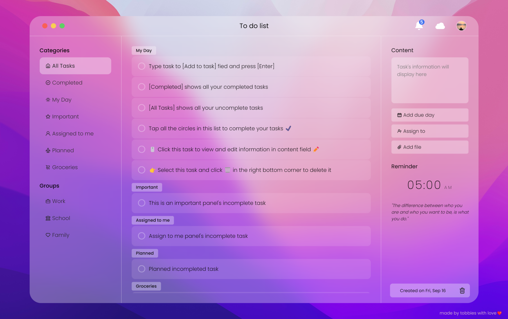

# To Do Web App
## How to use
- To add a task, type your task into the input field "Add a task"
- To mark task as completed, click to circle button at left side of this one
- To edit task, click to task then rewrite at right "Content" input field
- To delete task, choose the task and click RecycleBin🗑️ button
### [Deployment](https://tobbiesfake.github.io/to-do-app)

